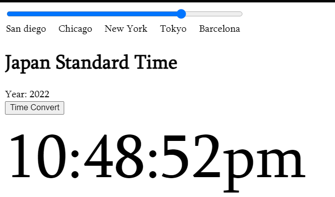
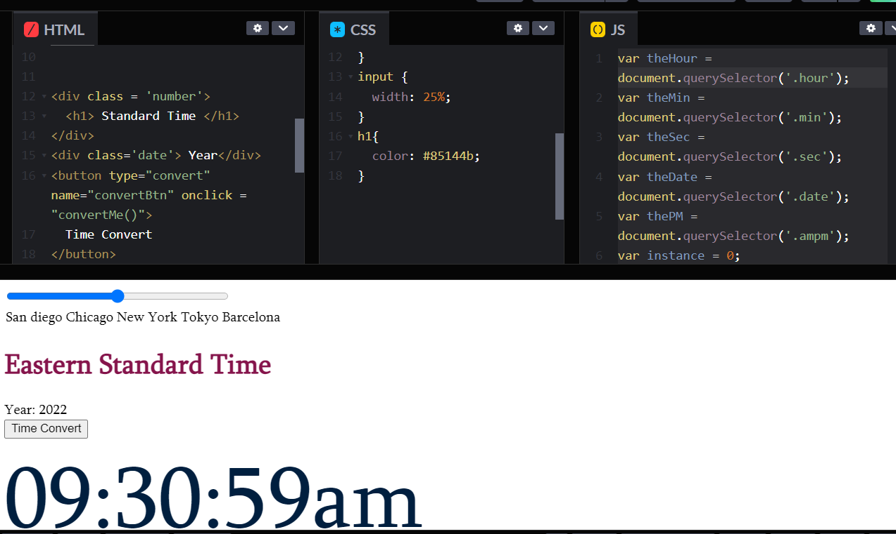
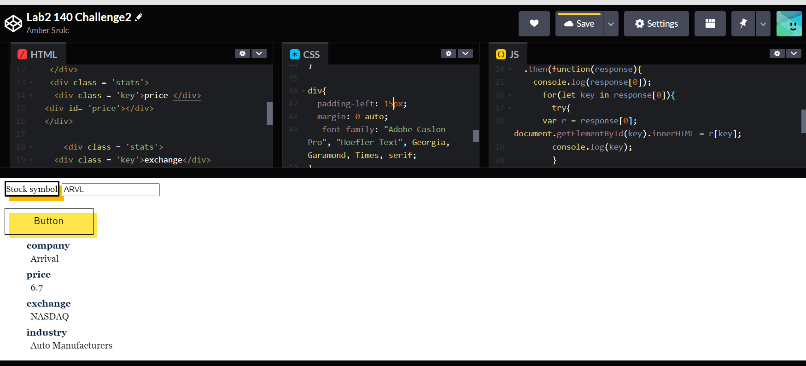
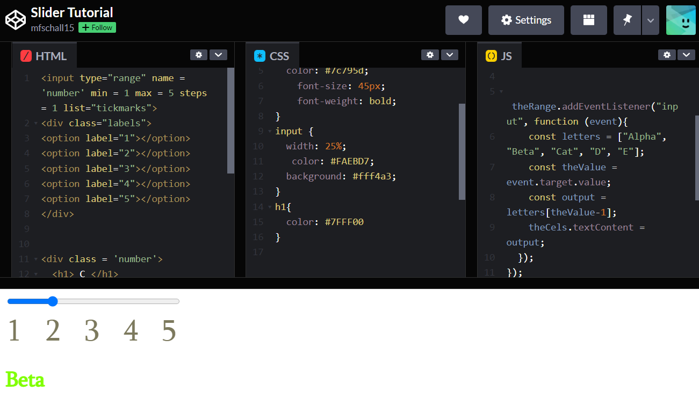
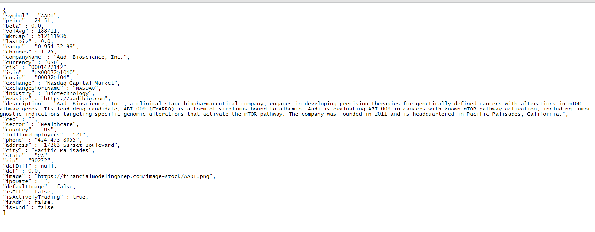

# ece-140a-winter-2022-20aszulc
ece-140a-winter-2022-20aszulc created by GitHub Classroom

## Name: Amber Szulc
## PID: A16241551

## Challenge 1:
https://codepen.io/aszulc/pen/xxXBEym
Functionality (step 3) I have added: Altering the Military standard time to 
am/pm time with the push of a button. I also added the accurate year.
I added an am/pm versus hours label. Along with which standard time
we are in based on the moving slider. In lab2proof, the code is also in a txt file alongside the link above.

## Challenge 2:
https://codepen.io/aszulc/pen/abLMRdM 
Above is link to assignment. Features I added: designing better layout
button, and labels. Then I added the price, company name, industy, and exchangeIn lab2proof, the code is also in a txt file alongside the link above.

## Tutorial 1:
Please see Lab2 proof for Slider tutorial and tutorial 1 changes. 
The tutorial is a slider that changes the value of the letters when the
slider is moved. The tutoria also shows off a clock that changes time in
accordance to military hours in pacific standard time. The offset
allows you to choose different time zons t#han pactic stanard
and the UTC is a shortened version of the time given.

## Tutorial 2:
API is an application program interface. We will be using financial stats extracted from the API ticker symbol and an "apikey=". I personally tried the AADI company ticker symbol after the AAPL was initially given. The JSON is an array of object that shows up in the documented webpage.

