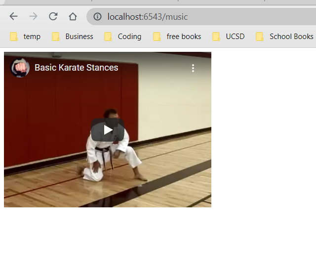

# ece-140a-winter-2022-20aszulc
ece-140a-winter-2022-20aszulc created by GitHub Classroom

Name: Amber Szulc
PID: A16241551
### Tutorial 1
  ###### Question1: 
  The result is [-20 -10 -16  -8]
  shape:(4,)
  ###### Question 2: 
  Methods used: flatten & resize
  ###### Question 5:
Arrange and lin space differ as linspace enables you to control the precise end value, whereas arange gives you more direct control over the increments between values in the sequence. Arrange is best for creating an array of integers
Use linspace over arrange when
Tutorial1 proof:
  ##### All other quesstions are answered in tutorial1 proof png
[Tutorial 1 Screenshots](Screenshots/tutorial1_proof.PNG)

I learned from Tutorial 1 how to initialize an array. I also learned how to create an array of numpy from just zeros or just 1s. I learned how t o flatten and change the shape of an array.

### Tutorial 2
  [Tutorial 2 Screenshots](Screenshots/tutorial_opencv_grey_proof.PNG)
  [Tutorial 2 Screenshots](Screenshots/tutorial_opencv_invert_proof.PNG)
    [Tutorial 2 Screenshots](Screenshots/tutorial_opencv_squish_proof.PNG)
  Question 1:

Question 2:

Summary:
Tutorial 2 I learned how to change the version of my python in anaconda. I also learned how to install the CV package. I learned how to alter the coloring of an image. I also learned how to show the image on my screen, then delete ist.

### Tutorial 3
 [Tutorial 3 Screenshots](Screenshots/tutorial_pyramid_app1_proof.PNG)
 [Tutorial 3 Screenshots](Screenshots/tutorial_pyramid_app0_proof.PNG)
 

This tutorial I leaarned how to make a web server. I was able to configure the directory for static resources, and then view the configure with "add_static_view". I also learned how to bing the static resources to a folder. I learned how to make a localhost in my browser

### Tutorial 4

The first input (“textInput”) will allow you to select values. There are a few extra attributes mentioned in this tag. What are they?
##### The tags are input of the type number, an input of the type button and an image tag. The textInput tag also allows you to choose a number between 1 and 5, and has a type number and value of 1
Explain what you learned in this tutorial in the README.md file 
##### I learned how to host a simple server on a webpage. I learned JSON maps photo to ID. I learned that config.make_wsgi_app() makes an app with configuration of app above and that static view maps the folder to the url with images. REST is used to piece together components
 [Tutorial 4 Screenshots](Screenshots/tutorial_rest_proof_2.PNG)
 [Tutorial 4 Screenshots](Screenshots/tutorial_rest_proof_3.PNG)
 [Tutorial 4 Screenshots](Screenshots/tutorial_rest_proofmusic.PNG)
 [Tutorial 4 Screenshots](Screenshots/tutorial_rest_4.PNG)

## Challenge 1

 [Challenge 1 Screenshots](Screenshots/challenge1_proof_homepage.PNG)
 [Challenge 1 Screenshots](Screenshots/challenge1_proofmusic.PNG)

## Challenge 2

 [Challenge 2 Screenshots](Screenshots/challenge2_proof_1.PNG)
[Challenge 2 Screenshots](Screenshots/challenge2_proof_2.PNG)
[Challenge 2 Screenshots](Screenshots/challenge2_proof_3.PNG)
[Challenge 2 Screenshots](Screenshots/challenge2_proof_4.PNG)
[Challenge 2 Screenshots](Screenshots/challenge2_proof_5.PNG)

