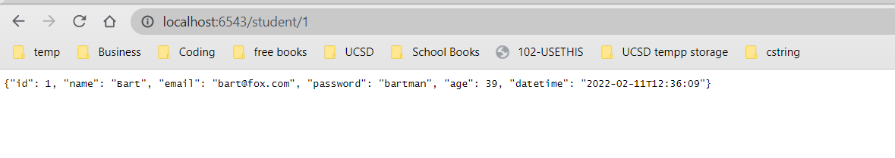
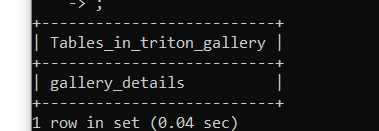

# ece-140a-winter-2022-20aszulc
ece-140a-winter-2022-20aszulc created by GitHub Classroom

Name: Amber Szulc
PID: A16241551

PLEASE LOOK IN THE FIG FOLDER FOR WORKING VERSIONS OF THE TUTORIALS AND CHALLENGES
## Tutorial 1
Import the SQL connector, and the the credential.env
Don't allow people to gain access to oyur creential
Cursor allows yyou to view output while fetch all alls the rows resulted from cursor queryy. Then you select the entire table, order by age, and update the change.

## Tutorial 2
This tutorial we installed jinja. We made a students server. We set up a lab 5 database in sql. We renedred the table into json using sql commands. Then we put the data on the web page using the get_studentes and student routes. Fetchall allows us to fetch all the data We can insert the table of data into our html file using the fetchall() command then inserting the jinja 

## Tutorial 3
This tutorial we install pyyramid, my sql connector and be able to access database credentials with python dotenv. The init-db.py will intialize our database schema. We create a teaching staff table and catch runtime error. Then we asdd 5 fields of data into the table. On the backend we will create a websit with pyyramid. We return the id data into a table as a json response. On front end we create an html page where we use a drop down and our own api. In Js we create our select_staff() function. Then we run init-db then python app.py

## Challenge 1:
This is youtube video link!!!
# https://youtu.be/kgW1zYdkcYQ 
<iframe width="560" height="315" src="https://www.youtube.com/embed/kgW1zYdkcYQ" title="YouTube video player" frameborder="0" allow="accelerometer; autoplay; clipboard-write; encrypted-media; gyroscope; picture-in-picture" allowfullscreen></iframe>

